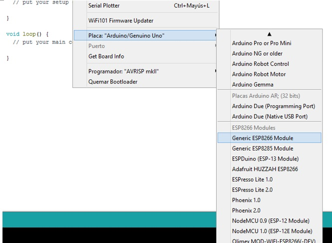
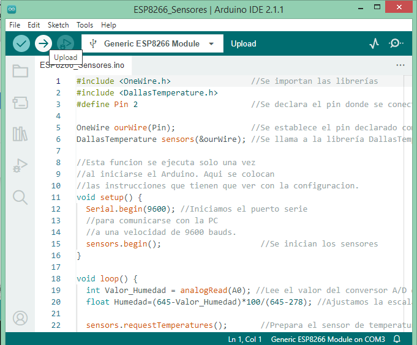
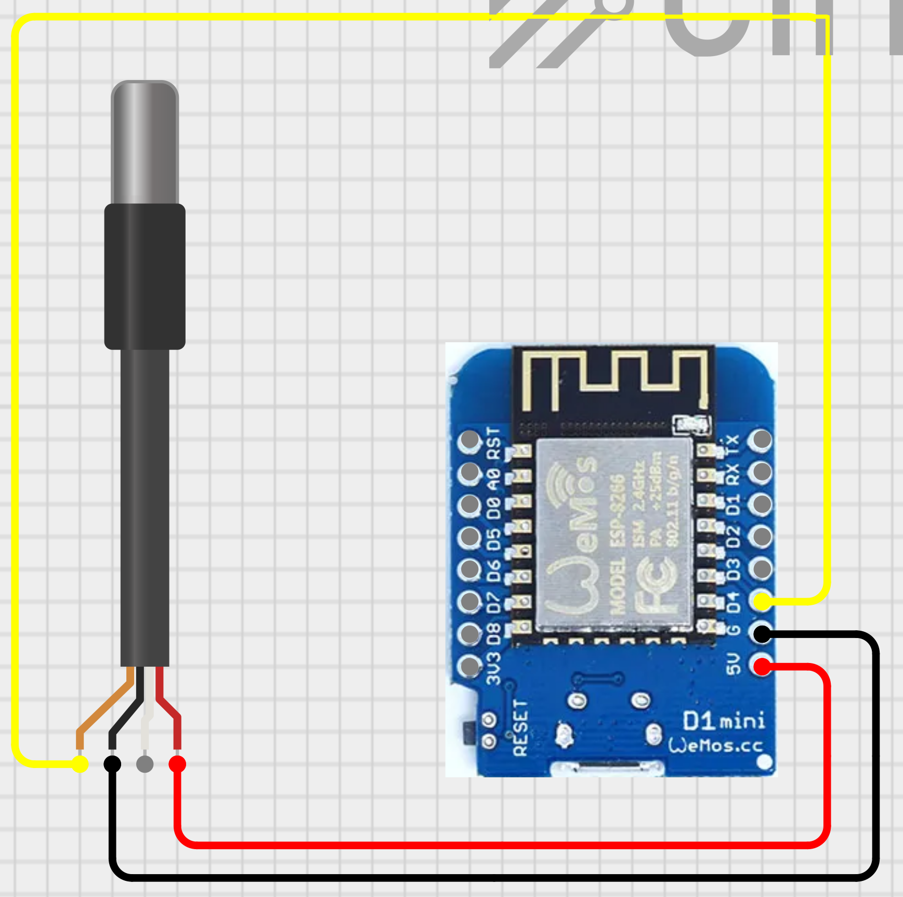
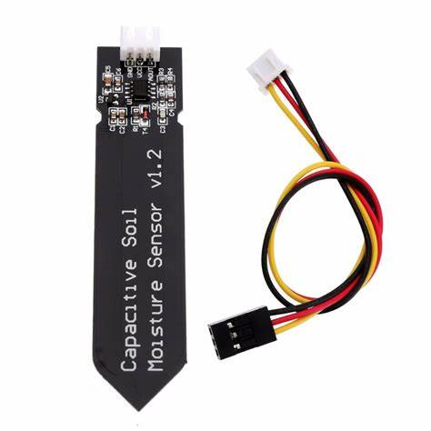
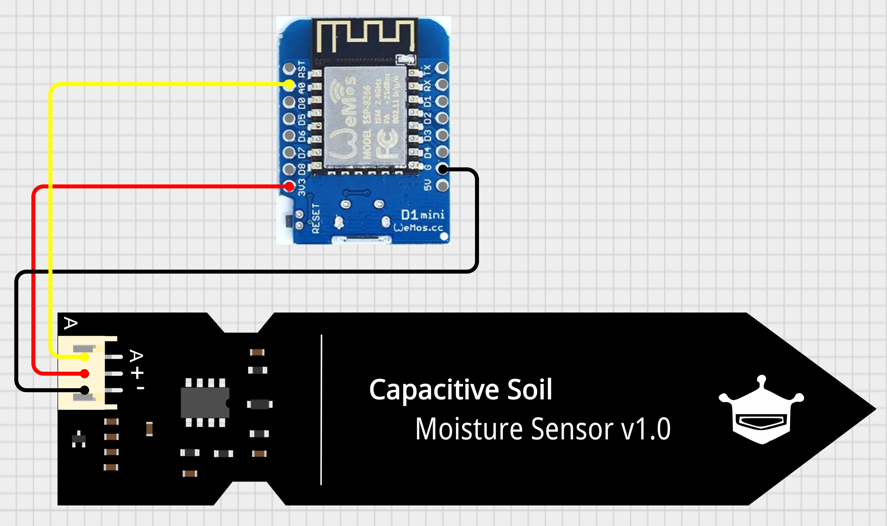
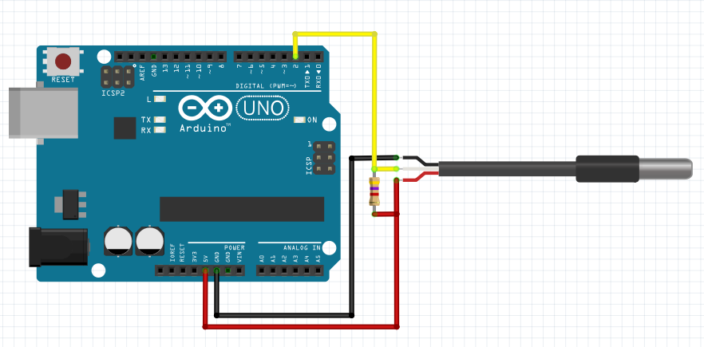

## Carga del firmware

Esta aplicación es muy sencilla. Lee los datos de ambos sensores y los envía a la computadora para visualizarlos.

1. Descargar a su PC el [firmware](firmware/firmware.ino)
2. Abrir la aplicación Arduino IDE
3. Abrir el código que descargó en el punto 1.
4. Conectar el Arduino a la computadora con el cable USB.
5. Como no vamos a usar una placa de Arduino en este taller, tenemos que instalar los controladores para la placa:

   Este paso es necesario para que  nuestro IDE de arduino reconozca a nuestro ESP8266 como una tarjeta.
   Debemos tener ya instalado nuestro Arduino IDE con versión 1.6.4 o superior.
   Seguidamente vamos a archivo>Preferencias y en la casilla  “Gestor de URLs Adicionales de Tarjetas” agregamos:
   http://arduino.esp8266.com/stable/package_esp8266com_index.json 

   

   Seguidamente vamos a Herramientas>placa: … >Gestor de Tarjetas
   Y buscamos en la lista  “esp8266 by ESP8266 Community“, lo seleccionamos  e instalamos

   

6. Seleccionar la placa Arduino que corresponde.
   En herramientas>placas, deben de estar las nuevas placas instaladas.
   
   

7. Cargar el firmware descargado en el punto 1.

   
   

   
8. Abrir el *monitor serial* o el *serial plotter*

9. Asegurarse que la velocidad de comunicación está seteada en 9600 bauds

# Sensor de temperatura DS19B20

## Especificaciones
- Resolución A/D: 12 bits
- Resolución en temperatura: 0.5°C
- Voltage de operación: 5V

El módulo tiene 3 terminales (pines) de conexión:
- 1. VCC: conectar a +5V
- 2. D: salida de datos
- 3. GND: conectar a GND

## Diagrama de conexión con ESP8266

   Repetí los puntos 7, 8 y 9 de la primera sección y deberias poder ver los valores por consola.

### AHORA PROBÁ CALENTAR EL SENSOR CON LA MANO!!!

# Sensor de humedad de suelo

## Descripción

   Este módulo contiene un [sensor capacitivo de humedad de suelo](https://create.arduino.cc/projecthub/MisterBotBreak/how-to-use-a-soil-moisture-sensor-ce769b)
   El sensor envía una señal analógica al ESP8266.

## Especificaciones
- Salida analógica
- Voltage de operación: 3.3V

El módulo tiene 4 terminales (pines) de conexión:
- 1. AO: salida de datos
- 2. 3V: conectar a 3.3V
- 3. GND: conectar a GND

## Diagrama de conexión con ESP8266

   Repetí los punto 7, 8 y 9 de la primera sección y deberias poder ver los valores por consola.
### AHORA PROBÁ METER EL SENSOR EN AGUA DE A POCO!!!

# Sensores de humedad y temperatura en conjunto
   Vamos a conectar los dos sensores a una misma placa para poder observar temperatura y humedad al mismo tiempo. Para esto, utilizamos el mismo firmware descargado en el punto 1, y para las conexiones seguimos el siguiente diagrama: 

 

Ahora, siguiendo los puntos 7, 8 y 9 de la primera sección, deberíamos poder ver en el monitor los valores de humedad y temperatura.

