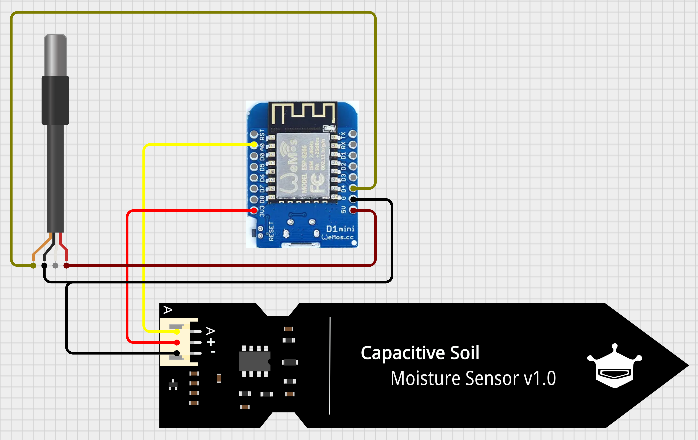

## Carga del firmware

Esta aplicación es muy sencilla. Lee los datos de ambos sensores y los envía a la computadora para visualizarlos.

1. Descargar a su PC el [firmware](firmware/firmware.ino)
2. Abrir la aplicación Arduino IDE

3. Abrir el código que descargó en el punto 1.
4. Conectar el Arduino a la computadora con el cable USB.
5. Seleccionar el puerto serie correspondiente al Arduino.

6. Seleccionar la placa Arduino que corresponde.

7. Cargar el firmware.
8. Abrir el *monitor serial* o el *serial plotter*

9. Asegurarse que la velocidad de comunicación está seteada en 9600 bauds

# Sensor de temperatura DS19B20

## Especificaciones
- Resolución A/D: 12 bits
- Resolución en temperatura: 0.5°C
- Voltage de operación: 5V

El módulo tiene 3 terminales (pines) de conexión:
- 1. VCC: conectar a +5V
- 2. D: salida de datos
- 3. GND: conectar a GND

## Diagrama de conexión con Arduino

### AHORA PROBÁ CALENTAR EL SENSOR CON LA MANO!!!

# Sensor de humedad de suelo

## Descripción

Este módulo contiene un [sensor capacitivo de humedad de suelo](https://create.arduino.cc/projecthub/MisterBotBreak/how-to-use-a-soil-moisture-sensor-ce769b)
El sensor envía una señal analógica al Arduino.

## Especificaciones
- Salida analógica
- Voltage de operación: 3.3V

El módulo tiene 4 terminales (pines) de conexión:
- 1. AO: salida de datos
- 2. 3V: conectar a 3.3V
- 3. GND: conectar a GND

## Diagrama de conexión con Arduino

### AHORA PROBÁ METER EL SENSOR EN AGUA DE A POCO!!!

